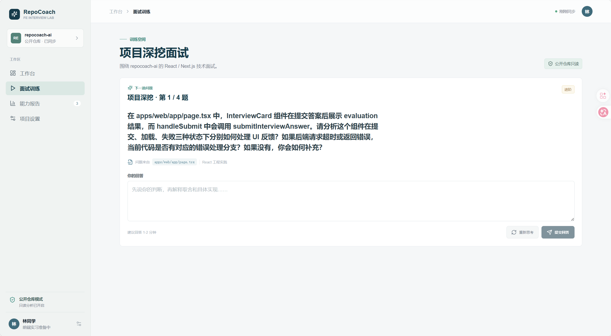
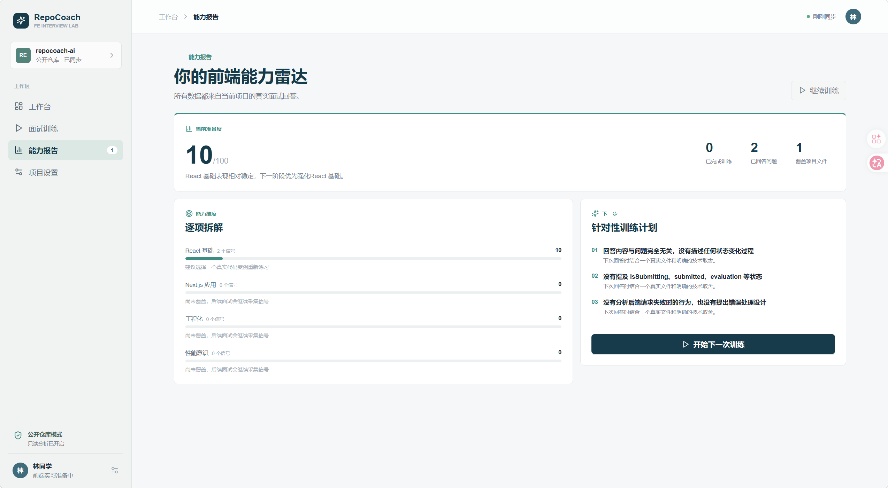
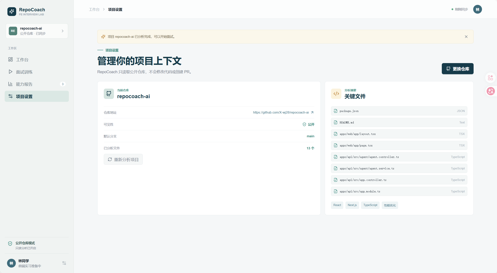

# RepoCoach FE

[](https://github.com/X-wj28/repocoach-ai/actions/workflows/ci.yml) [](LICENSE) [](https://nodejs.org/)

面向前端实习生的 GitHub 项目深挖与 AI 技术面试训练工具。

RepoCoach FE 会读取公开的 React/Next.js 仓库和目标岗位 JD，围绕真实代码生成项目面试题，评价回答，并持续沉淀个人能力报告。项目支持 DeepSeek 真实模型，也提供无需模型密钥的本地兜底模式。

## 核心能力

- 公开 GitHub 仓库分析：识别技术栈、README、目录树和关键 TypeScript/TSX 文件
- AI Agent 面试：结合项目代码与岗位 JD 生成问题、追问和结构化评价
- 完整账号体系：邮箱注册登录、`HttpOnly` Cookie 会话和用户数据隔离
- 训练记录：保存每次问答、评分、优点和改进建议，支持回放与 Markdown 导出
- 能力报告：按 React、Next.js、工程化和性能意识聚合真实训练信号
- 工程化交付：Prisma 迁移、PostgreSQL、Docker Compose 和 GitHub Actions CI

## 产品界面

| 项目深挖面试                                        | 能力报告                                       |
| --------------------------------------------------- | ---------------------------------------------- |
|  |  |



所有截图均来自本地 Docker 环境的真实运行界面。面试问题、评价和报告由实际 API 返回，不是静态设计稿。

## 简历与面试材料

可直接用于简历和项目面试的中文描述、技术亮点和讲解提纲见 [docs/resume-project.md](docs/resume-project.md)。

## 技术架构

```text
Browser
  |
  v
Next.js 14 + React + TypeScript
  |
  | REST + HttpOnly Cookie
  v
NestJS API
  |-- GitHub Public API
  |-- DeepSeek API / local fallback
  '-- Prisma ORM --> PostgreSQL
```

```text
apps/
  web/       Next.js 前端工作台
  api/       NestJS API、Agent 编排、认证与报告
packages/
  shared/    前后端共享类型
docs/        产品和架构文档
```

## 本地开发

需要 Node.js 22+、npm 10+ 和 Docker Desktop。

1. 从 `.env.example` 复制一份 `.env`。
2. 启动 PostgreSQL 并应用迁移。
3. 启动前后端开发服务器。

```powershell
npm install
docker compose up -d postgres
npm run db:deploy
npm run dev
```

- 前端：<http://localhost:3002>
- API 健康检查：<http://localhost:4000/api/v1/health>

Windows 上 Docker/WSL 可能保留端口 3000，因此本项目默认使用 3002。

## Online deployment

A production-ready deployment guide for Vercel + Render is available in [docs/deployment.md](docs/deployment.md).

## Docker 一键启动

下面的命令会构建 Web、API 和 PostgreSQL，并在 API 启动前自动应用 Prisma 迁移：

```powershell
docker compose up -d --build
docker compose ps
```

停止服务但保留数据库：

```powershell
docker compose down
```

## 环境变量

| 变量                  | 用途                           | 默认值                         |
| --------------------- | ------------------------------ | ------------------------------ |
| `NEXT_PUBLIC_API_URL` | 浏览器访问 API 的地址          | `http://localhost:4000/api/v1` |
| `WEB_ORIGIN`          | API 允许跨域访问的前端地址     | `http://localhost:3002`        |
| `DATABASE_URL`        | 本机开发数据库连接             | PostgreSQL 本地容器            |
| `DOCKER_DATABASE_URL` | API 容器访问数据库的连接       | Compose 内部 PostgreSQL        |
| `DEEPSEEK_API_KEY`    | 启用真实 DeepSeek Agent        | 未配置时使用本地兜底           |
| `GITHUB_TOKEN`        | 提高 GitHub API 请求额度       | 可选                           |
| `COOKIE_SECURE`       | HTTPS 部署时启用 Secure Cookie | 本地 `false`                   |

不要提交 `.env`、GitHub Token 或模型 API Key。

## 常用命令

```powershell
npm run dev             # 启动本地开发环境
npm run build           # 构建前端和 API
npm run lint            # 检查前端代码
npm run test:api        # 构建并执行 API 单元测试
npm run db:generate     # 生成 Prisma Client
npm run db:migrate      # 创建开发迁移
npm run db:deploy       # 应用已有迁移
npm run db:import-sqlite # 导入旧 SQLite 数据，可重复执行
```

## 数据与安全边界

仓库内容始终按不可信输入处理，Agent 提示词会忽略仓库内试图改变任务或索取信息的指令。应用只读取公开仓库，不修改代码、不创建 PR，也不会把 Token 返回给浏览器。

用户、会话、面试记录和报告存储在 PostgreSQL 中。Prisma 数据模型位于 `apps/api/prisma/schema.prisma`。

## CI

每次推送到 `main` 或创建 Pull Request 时，GitHub Actions 会执行：

1. `npm ci`
2. Prisma Client 生成
3. 前端 lint
4. API 自动化测试
5. 前后端生产构建

## 当前范围

当前版本面向公开仓库和文本面试。私有仓库、GitHub OAuth、语音面试和云端部署属于后续迭代。

## License

MIT
